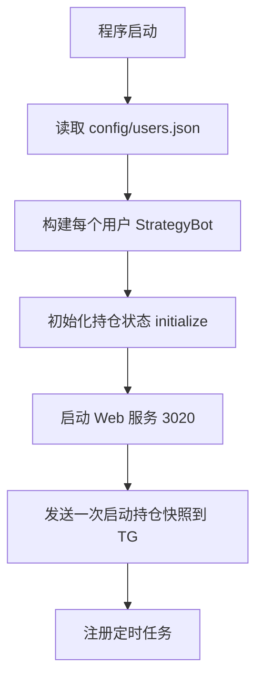
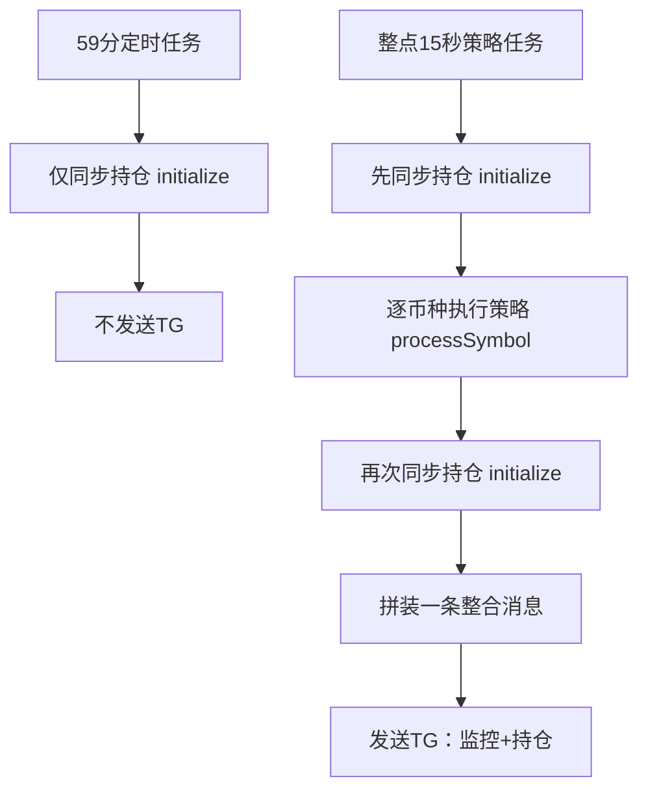
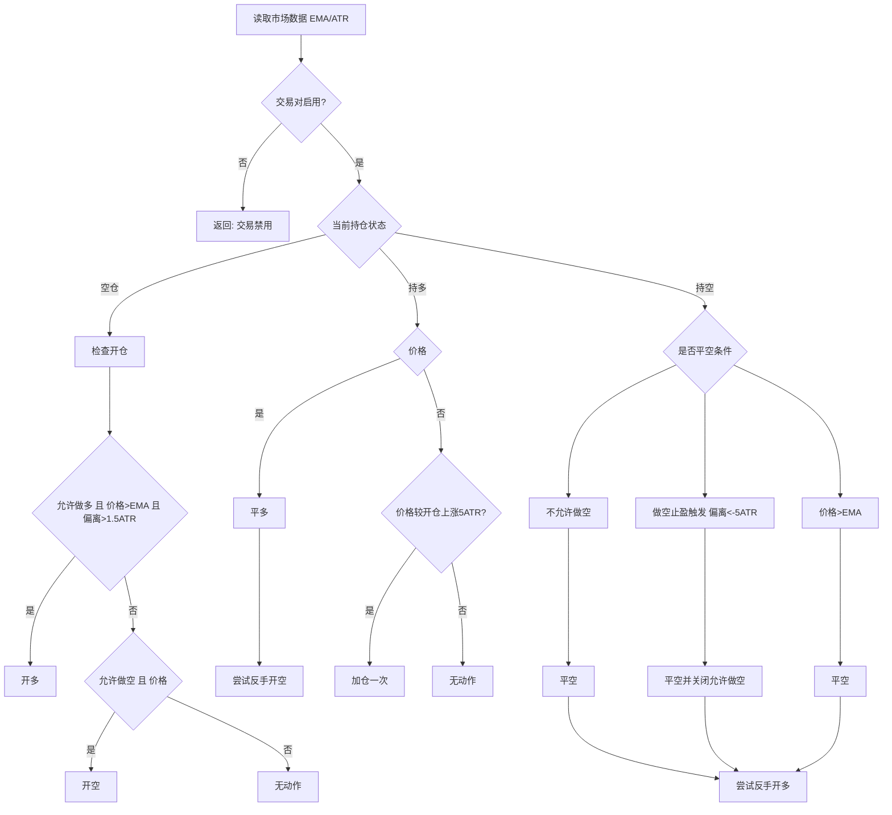
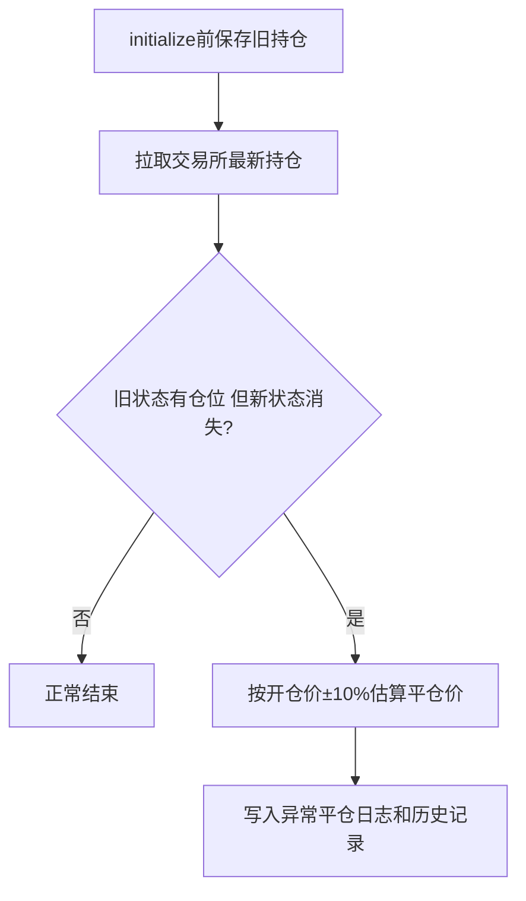
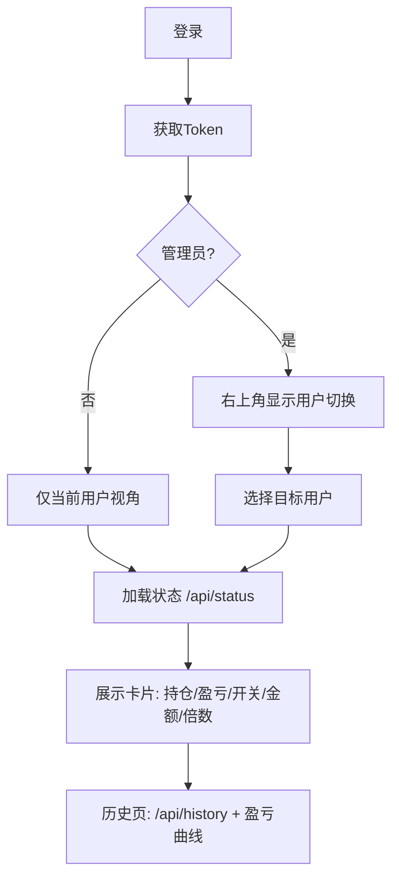

# 程序流程图（当前版本）

## 1. 启动流程

```mermaid
flowchart TD
    A[程序启动] --> B[读取 config/users.json]
    B --> C[构建每个用户 StrategyBot]
    C --> D[初始化持仓状态 initialize]
    D --> E[启动 Web 服务 3020]
    E --> F[发送一次启动持仓快照到 TG]
    F --> G[注册定时任务]
```

## 2. 定时任务流程

```mermaid
flowchart TD
    A[59分定时任务] --> B[仅同步持仓 initialize]
    B --> C[不发送TG]

    D[整点15秒策略任务] --> E[先同步持仓 initialize]
    E --> F[逐币种执行策略 processSymbol]
    F --> G[再次同步持仓 initialize]
    G --> H[拼装一条整合消息]
    H --> I[发送TG：监控+持仓]
```

## 3. 单币种策略状态机

```mermaid
flowchart TD
    A[读取市场数据 EMA/ATR] --> B{交易对启用?}
    B -- 否 --> X[返回: 交易禁用]
    B -- 是 --> C{当前持仓状态}

    C -- 空仓 --> D[检查开仓]
    D --> D1{允许做多 且 价格>EMA 且 偏离>1.5ATR}
    D1 -- 是 --> D2[开多]
    D1 -- 否 --> D3{允许做空 且 价格<EMA 且 偏离<-1.5ATR}
    D3 -- 是 --> D4[开空]
    D3 -- 否 --> D5[无动作]

    C -- 持多 --> E{价格<EMA?}
    E -- 是 --> E1[平多] --> E2[尝试反手开空]
    E -- 否 --> E3{价格较开仓上涨5ATR?}
    E3 -- 是 --> E4[加仓一次]
    E3 -- 否 --> E5[无动作]

    C -- 持空 --> F{是否平空条件}
    F --> F1[不允许做空]
    F --> F2[做空止盈触发 偏离<-5ATR]
    F --> F3[价格>EMA]
    F1 --> F4[平空]
    F2 --> F5[平空并关闭允许做空]
    F3 --> F6[平空]
    F4 --> F7[尝试反手开多]
    F5 --> F7
    F6 --> F7
```

## 4. 强平/异常平仓检测

```mermaid
flowchart TD
    A[initialize前保存旧持仓] --> B[拉取交易所最新持仓]
    B --> C{旧状态有仓位 但新状态消失?}
    C -- 否 --> D[正常结束]
    C -- 是 --> E[按开仓价±10%估算平仓价]
    E --> F[写入异常平仓日志和历史记录]
```

## 5. Web 控制台流程

```mermaid
flowchart TD
    A[登录] --> B[获取Token]
    B --> C{管理员?}
    C -- 是 --> D[右上角显示用户切换]
    C -- 否 --> E[仅当前用户视角]
    D --> F[选择目标用户]
    E --> G[加载状态 /api/status]
    F --> G
    G --> H[展示卡片: 持仓/盈亏/开关/金额/倍数]
    H --> I[历史页: /api/history + 盈亏曲线]
```
